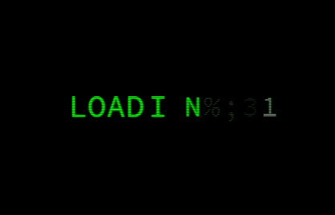

 

<h2 align="center">Product Engineer | Java Full Stack Developer</h2>

---

### 👩‍💻 About Me

I'm an **Associate Consultant** passionate about building scalable, secure, and user-friendly enterprise applications.

I work primarily with **Java, Spring Boot, Angular, Oracle SQL, and REST APIs**, while also exploring modern frontend technologies like **React.js**.

- 💼 Associate Consultant
- 🌱 Currently enhancing my expertise in Microservices, System Design, and Cloud Technologies
- 💻 Interested in Backend Development, Full Stack Development, and Enterprise Applications
- 🚀 Always learning new technologies and improving my problem-solving skills

 

### 🔨 Projects

- 🍔 **Eatzilla** – A modern food delivery web application built with React.js.
- ✈️ **WanderWhirl** – A responsive travel website with interactive UI.
- 🧮 **BMI Calculator** – Responsive React application featuring Dark/Light mode, Toast notifications, and BMI calculation.
- 💼 **Enterprise Banking Applications** – Developed secure REST APIs and Angular-based modules using Spring Boot for banking and investment workflows.

---

## 🌐 Connect With Me

&nbsp;

---

# 💻 Tech Stack

 

---

# 📊 GitHub Stats

---

### 🏆 Top Contributed Repositories

---

### 👀 Profile Views

---

*"Code. Learn. Build. Improve. Repeat."* 🚀

